<picture>
  <source media="(prefers-color-scheme: dark)" srcset="assets/header-dark.svg">
  
</picture>

Before Jakarta I spent a few years in Brisbane: a second degree at UQ, a semester of tutoring there, and a run as the first engineer at a music streaming startup that paid artists 80% of every subscription. First degree was Computer Science at Universitas Indonesia.

I like the unglamorous parts of the job. The tables I draw on day one before any screen exists. The loading state that doesn't jump. The error message that tells you what to do next. None of it shows up in a demo, all of it shows up by the second week of real use.

Away from the keyboard I [take photos](https://firlandiansyari.com/photography). Most of my side projects end up being made for people I know rather than users I don't: a bingo night invite, a movie-night streaming front end, a small site made for exactly one person.

<picture>
  <source media="(prefers-color-scheme: dark)" srcset="assets/band-1-dark.svg">
  
</picture>

**Things I've made**

<a href="https://github.com/faransyari/menuscanorder"><picture>
  <source media="(prefers-color-scheme: dark)" srcset="assets/row-menuscanorder-dark.svg">
  
</picture></a>
<a href="https://github.com/faransyari/pc-marketplace"><picture>
  <source media="(prefers-color-scheme: dark)" srcset="assets/row-pc-marketplace-dark.svg">
  
</picture></a>
<picture>
  <source media="(prefers-color-scheme: dark)" srcset="assets/row-landi-bot-dark.svg">
  
</picture>
<picture>
  <source media="(prefers-color-scheme: dark)" srcset="assets/row-clinic-dark.svg">
  
</picture>
<a href="https://firlandiansyari.com"><picture>
  <source media="(prefers-color-scheme: dark)" srcset="assets/row-site-dark.svg">
  
</picture></a>

<picture>
  <source media="(prefers-color-scheme: dark)" srcset="assets/band-2-dark.svg">
  
</picture>

**Rules I try to keep**

1. Settle the data model before the UI.
2. Every animation has to earn its place.
3. If I can't explain a dependency in one sentence, it goes.

<picture>
  <source media="(prefers-color-scheme: dark)" srcset="assets/footer-dark.svg">
  
</picture>

<a href="https://firlandiansyari.com">firlandiansyari.com</a> · <a href="https://linkedin.com/in/firlandi">linkedin</a> · firlandi.althaf@gmail.com every picture on this page is drawn by <a href="scripts/draw.mjs">one script</a>

